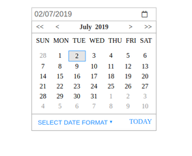

# React Date Picker



# Commands
- `npm test` - Run tests with linting and coverage results.

- `npm run build` - Babel will transpile ES6 => ES5 and minify the code.
- `npm start` - Runs the app in the development mode.
Open http://localhost:3000 to view it in the browser.


## Installation

### The package can be installed via NPM:

```
npm install react-datepicker --save

```

You’ll need to install React and PropTypes separately since those dependencies aren’t included in the package.


```js
import React from "react";
import DatePicker from "my-react-date-picker";

import "my-react-date-picker/dist/react-datepicker.css";

```
# License

MIT © Sajan